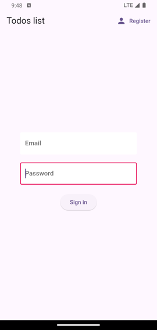
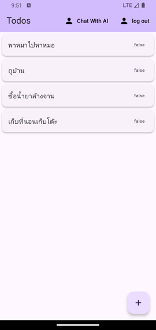
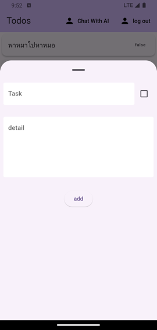
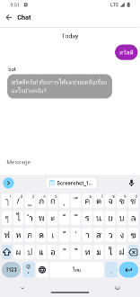

# todos

แอป Todo list ที่สามารถเพิ่มลบแก้ไข (CRUD Operation) และมี OpenAI Chatapp ที่สามารถถามตอบ กับ ข้อมูลใน Firestore






## Getting Started

1. ทำการ Login ผ่าน firebasecli กับบัญชีที่ทำการเปิด Account เอาไว้แล้ว
```
firebase login
```

2. ให้เปิดการใช้งาน flutterfire_cli ให้เรียบร้อย
```
dart pub global activate flutterfire_cli
```

2. ใช้คำสั่งด้านล่างในการ ผูกกับ firebase ให้เรียบร้อย
```
flutterfire configure --project=[Project ที่ทำการเปิดไว้]
```

